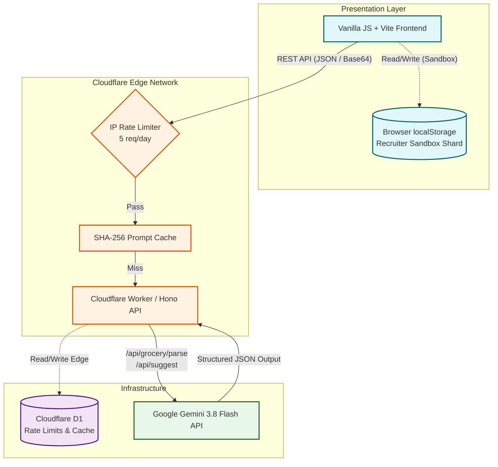

# Case Study: Serverless AI Data Ingestion
**The Essential Eats Architecture**

---

## Page 1: The Problem Statement

### Why Traditional Chatbot Memory Fails for Constraint-Based Workflows

The current paradigm of conversational AI, which relies on linear chat histories and unstructured context windows, fundamentally fails when applied to rigorous, constraint-based workflows. In the context of meal planning and kitchen inventory management, this failure becomes glaringly apparent for two primary reasons:

**1. Cognitive Load and Executive Dysfunction (AuDHD Context)**
Users managing ADHD or Autism Spectrum conditions often face executive dysfunction, making the mental overhead of meal planning—taking stock of inventory, deciding what to make, and cross-referencing ingredients—exhausting. Traditional chatbots require users to manually input what they have, remember context across sessions, and prompt the AI perfectly to get a usable recipe. This shifts the cognitive burden *onto* the user rather than alleviating it. A truly assistive system must reverse this paradigm: it should automatically know the state of the inventory and proactively generate solutions without requiring conversational prompting.

**2. Strict Dietary Allergen Matrices**
When dealing with severe dietary restrictions (e.g., Celiac disease, nut allergies), "close enough" is dangerous. LLM chatbots are prone to hallucinations and context-dropping over long conversations. A chatbot might remember a gluten allergy in prompt 2, but forget it by prompt 10 when generating a recipe. Constraint-based workflows require rigid, zero-hallucination guardrails where dietary constraints are deterministically injected into every single generation cycle, overriding any conversational drift.

To solve this, **Essential Eats** abandons the chatbot model entirely. Instead, it utilizes AI as a silent, background constraint-solver, reading from a deterministic state and outputting structured data.

---

## Page 2: The Backend Architecture

### Endpoint Map

The backend is built entirely on edge infrastructure to ensure global low latency, utilizing **Hono** running on **Cloudflare Workers**. This allows the API to operate close to the user while seamlessly interfacing with Cloudflare D1 (Serverless SQLite) and the Gemini API.

*   **`POST /api/grocery/parse`**
    *   **Function:** Multimodal ingestion of messy OCR text or camera photos.
    *   **Logic:** Passes data through a strictly typed prompt pipeline that forces the AI into:
        1. **Multipack Unpacking:** Mathematical conversion of packages (`"12-pack Wet Cat Food"` $\rightarrow$ `quantity: 12`, `"1 Dozen Eggs"` $\rightarrow$ `12`).
        2. **Brand Stripping:** Sanitizes brand noise (`"Lays Kettle Chips"` $\rightarrow$ `"Kettle Chips"`).
        3. **Context-Aware Category Matching:** Aligns incoming items with existing pantry stock categories.
    *   **Output:** Returns a rigidly structured JSON array ready for deterministic database insertion.

*   **`POST /api/suggest`**
    *   **Function:** The "Nourishing Supper" constraint solver.
    *   **Logic:** Dynamically queries the user's current inventory snapshot. It actively seeks protein/fresh anchors (`Fresh`, `Frozen Foods`, `Meat`), injects strict dietary guardrails (Gluten-Free, Dairy-Free, Nut-Free, Vegetarian, Vegan, Keto) combined with active UI toggles, and generates recipes.
    *   **Output:** Returns exactly 5 recipes in a rigid JSON format, detailing prep times, cooking temperatures, seasoning profiles, and concise, inspiring `chefTip` (Nourish Note) culinary guidance.

### Architecture Flowchart

