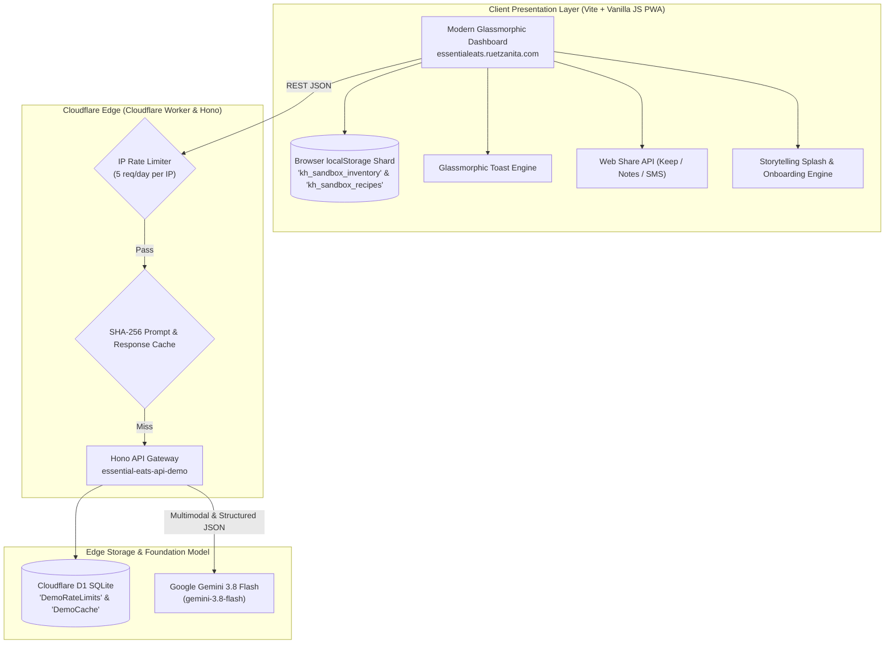

# Essential Eats 🥗

**Live Portfolio Demo:** [essentialeats.ruetzanita.com](https://essentialeats.ruetzanita.com)  
**Current Build:** `2026.10.02-A` • **API Protocol:** `2026.09.27-C`  

Essential Eats is an AI-powered smart kitchen inventory assistant and dynamic recipe formulation engine designed to eliminate food waste and answer the eternal question: *"What's for supper?"* 

It serves as a **public-facing portfolio and sandboxed demo**, allowing visitors, engineers, and recruiters to test edge AI capabilities without incurring unbounded API costs.

---

## Technical Architecture



---

## Core Capabilities & Recent Upgrades (Build 2026.10.01-B)

### 1. Multimodal & Context-Aware Receipt Ingestion (`/api/grocery/parse`)
- **Multimodal Camera & Upload:** Direct camera photo capture or image upload with automated client-side canvas compression.
- **Multipack Unpacking Math:** Intelligently resolves bulk units (e.g. `"12-pack Wet Cat Food"` $\rightarrow$ `quantity: 12, category: "Pets"`, `"2x 6pk Soda"` $\rightarrow$ `quantity: 12`, `"1 Dozen Eggs"` $\rightarrow$ `quantity: 12`).
- **Brand Stripping:** Automatically removes noisy manufacturer names (e.g. `"Lays Kettle Chips"` $\rightarrow$ `"Kettle Chips"`).
- **Pantry Context Matching:** Compares incoming items against the user's existing inventory to align categories (e.g. keeps broccoli under `Frozen Foods` if already stocked there).

### 2. Nourishing Supper Constraint Solver (`/api/suggest`)
- **Protein & Fresh Anchors:** Selects up to 5 protein/fresh anchors (`Fresh`, `Frozen Foods`, `Meat`) to build complete meals around.
- **Zero-Tolerance Dietary Guardrails:** Deterministically enforces strict dietary guardrails on every prompt (Gluten-Free, Dairy-Free, Nut-Free, Vegetarian, Vegan, Keto).
- **Culinary Nourish Notes:** Every recipe balances practical pantry reality with mindful nourishment—including execution steps, cooking temperatures, seasoning profiles, and a concise 2–3 sentence `chefTip` (Nourish Note) highlighting a special flavor touch and a versatile swap for next time.

### 3. Dedicated "OUT OF STOCK" Auto-Sorting
- Items with `quantity <= 0` are segregated into an `OUT OF STOCK` section at the bottom of the pantry list.
- Each out-of-stock card features a department badge, disabled decrement button, 1-tap restock (`+`) button, and a quick-add cart button.
- The bottom floating dock features a live red counter badge with smooth scrolling directly to the out-of-stock section.

### 4. Aisle-Categorized Grocery Export & Web Share
- Formats shopping lists into aisle-categorized markdown checklists with department emojis (`🥬 PRODUCE`, `🥩 MEAT`, `🥛 BEVERAGES`, `🥫 PANTRY & CANNED`, etc.).
- 1-tap **Web Share API** integration (`navigator.share`) targeting **Google Keep**, **Apple Notes**, **Messages**, or **WhatsApp**, with automated fallback to clipboard copying.

### 5. Smart Grocery Auto-Deduction
- Committing staged groceries automatically scans the user's shopping list, crossing off bought items and notifying the user via toast.

### 6. Non-Blocking Glassmorphic Toast Engine
- Replaced intrusive browser `alert()` and `confirm()` dialogs with CSS-animated glassmorphic toasts (`success`, `info`, `warning`, `error`).

### 7. Immersive Storytelling Splash & Onboarding Screen
- **Empathy-Driven Storytelling:** Welcomes tired users with an empathetic narrative addressing evening dinner fatigue and the dread of rummaging through cluttered cupboards, reassuring them that edge AI is here to solve supper without pantry chaos.
- **Visual Design System:** Features a luminous sunset gradient title (`#FFFFFF` to `#FFA785` to `#FF6B6B`), glowing pulse animations, balanced typography (`text-wrap: balance`), and smooth glassmorphic backdrops.
- **Interactive Feature Pillars:** Instant highlights for Gemini 3.8 Flash recipe formulation, multimodal receipt vision, and deterministic allergen guardrails.
- **Frictionless Entry Points:** 1-tap **"Step Into the Kitchen"** entry, plus a direct **"See 'What's For Supper?'"** shortcut that dismisses the splash and triggers the nourishing supper solver immediately.
- **Direct Creator Contact:** Integrated contact capsule linking directly to [hello@ruetzanita.com](mailto:hello@ruetzanita.com).
- **Persistent Header Access:** A permanent [`STORY`](#) button in the header bar allows re-summoning the modal anytime with `sessionStorage` persistence.

### 8. Ad-Free Recipe Web Clipper & Extension (Build 2026.10.02-A)
- **Manifest V3 Chrome Extension (`extension/`):** 1-tap web clipper for desktop browsers (Chrome, Edge, Brave, Arc) that strips 100% of website ads, autoplay videos, and blog preambles.
- **Schema.org & Deep AI Extraction (`/api/recipes/parse-url`):** Automatically extracts structured ingredients, instructions, cooking times, and yield directly from `Recipe` JSON-LD schemas. If a site hides recipes or lacks schema, edge Gemini 3.8 Flash performs deep text structuring.
- **Seamless Local Shard Sync:** Clipped recipes sync directly into `kh_sandbox_recipes` in the Essential Eats dashboard with live glassmorphic toasts.
- **Mobile Browser URL Portal & 1-Tap Bookmarklet:** Solves mobile browser limitations by providing an in-app "CLIP RECIPE FROM URL" modal and 1-tap bookmarklet (`javascript:...`) for iOS Safari and Android Chrome.

### 9. Sensory-Friendly Color Theme Engine (5 Palettes)
- **Neurodivergent & Sensory Accessibility:** Designed for users with sensory overload, ADHD, Autism, migraines, or eye fatigue who find dark-mode with neon/vibrant accents overwhelming.
- **5 Standard Sensory Palettes (3 Dark, 2 Light):**
  - 🌑 **Midnight Neon (Dark / Default):** Deep dark slate (`#0D0E12`) with vibrant sunset coral accents (`#FF6B6B`).
  - 🌿 **Warm Earth & Sage (Dark):** Muted olive stone (`#191C18`) with soft calming sage green (`#7EA172`), engineered for low stimulation and zero glare.
  - 🪻 **Lavender Dusk (Dark):** Twilight indigo slate (`#12131D`) with gentle, restful lilac (`#9E86E8`) for late-night kitchen sessions.
  - 🍵 **Linen & Matcha (Soft Light):** Soft unbleached linen (`#F2F4F0`) with pure white cards, forest slate text (`#19271E`), and fresh organic matcha green (`#3E7E52`).
  - 📜 **Paper & Oat (Warm Light):** Gentle warm oat milk (`#F5F4EE`) with pure white cards, high-clarity slate text (`#1E293B`), and terracotta accents (`#C75932`) for daylight reading and astigmatism comfort.
- **1-Tap Header Picker:** Instant switching via the `THEME` button with persistent `localStorage` saving, zero-flash startup initialization, and non-blocking toast notifications.

---

## The Sandbox Firewall Architecture

To showcase full application functionality to recruiters and public visitors without risking database tampering or uncontrolled Gemini API billing, Essential Eats implements a 3-layer sandbox firewall:

1. **Client-Side Data Shard (`localStorage`):**
   - Every visitor receives a personalized, offline database session stored in `localStorage` under `kh_sandbox_inventory` and `kh_sandbox_recipes`.
   - Adding, editing, and deleting items never touches private production databases.
2. **Edge IP Rate Limiting:**
   - Enforced by Cloudflare Workers and D1 (`DemoRateLimits` table).
   - Limits AI generation to 5 requests per day per IP address, shedding abusive traffic at edge latency.
3. **SHA-256 Edge Prompt Caching:**
   - Common recipe queries and test receipts are hashed and cached in Cloudflare D1 (`DemoCache` table), serving repeat requests instantly with zero token consumption.

---

## Running Locally

### 1. Backend API (Cloudflare Worker)
```bash
cd logic
npm install
npm test -- --run   # Run Vitest test suite
npm run dev         # Starts local Wrangler worker
```

### 2. Frontend Interface (Vite)
```bash
cd interface
npm install
npm run dev         # Launches Vite dev server at http://localhost:5173
npm run build       # Validates production build in interface/dist
```

### 3. Chrome Extension (Manifest V3)
```bash
# In Chrome / Edge / Brave:
# 1. Navigate to chrome://extensions and enable "Developer mode"
# 2. Click "Load unpacked" and select the extension/ directory
```

---

## Technical Whitepapers & Architecture Reports

- ❤️ [Product Philosophy & The North Star](./PHILOSOPHY.md)
- 📄 [Case Study: Serverless AI Data Ingestion](./Case_Study_Serverless_AI_Data_Ingestion.md) (also available as [PDF](./Case_Study_Serverless_AI_Data_Ingestion.pdf))
- 🛡️ [Security Whitepaper: LLM Guardrails & Infrastructure Hardening](./Security_Whitepaper_LLM_Guardrails.md) (also available as [PDF](./Security_Whitepaper_LLM_Guardrails.pdf))
- 📊 [Executive Architecture Summary](./EXECUTIVE_SUMMARY.md)
- 🧩 [Recipe Clipper Chrome Extension Guide](./extension/README.md)

---

## Repository Structure

```text
essential-eats/
├── .github/workflows/ci.yml       # Automated GitHub Actions CI test & build pipeline
├── data/
│   └── schema.sql                 # Cloudflare D1 database table definitions
├── extension/                     # Manifest V3 Chrome Extension (Recipe Clipper)
│   ├── manifest.json              # Extension metadata and permissions
│   ├── popup.html & popup.js      # Zero-ad extraction and preview modal
│   └── icons/                     # Web Store assets (16px, 48px, 128px)
├── interface/                     # Client Presentation Layer (Vite + Vanilla JS PWA)
│   ├── index.html                 # Application shell with glassmorphic dashboard
│   ├── src/                       # Modular state, UI, API, and utility scripts
│   └── wrangler.jsonc             # Cloudflare Pages deployment configuration
├── logic/                         # Edge API Gateway (Cloudflare Worker + Hono)
│   ├── src/index.js               # REST endpoints, rate limiting, and Gemini bindings
│   ├── test/                      # Vitest unit test suite (Cloudflare Worker pool)
│   ├── wrangler.jsonc             # Worker configuration and D1 database bindings
│   └── .env.example               # Environment variables template
├── LICENSE                        # Portfolio demonstration license
└── README.md                      # Architecture documentation and quickstart guide
```

---

## License & Attribution

Copyright (c) 2026 Anita Ruetz. All Rights Reserved.  
*Portfolio demonstration version of Kitchen Hub.*

